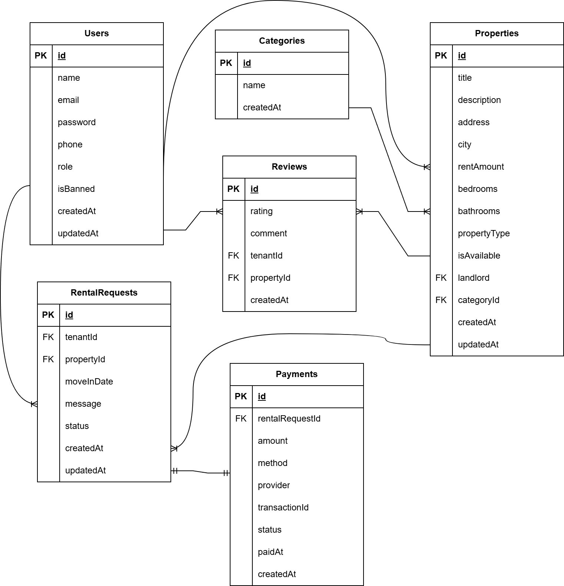

# RentNest 🏠
**"Find & List Rental Properties with Ease"**

---

## Project Overview

RentNest is a backend API for a rental property marketplace. Landlords can list properties, manage availability, and approve or reject rental requests. Tenants can browse listings, submit rental requests, and leave reviews. Admins oversee the entire platform, managing users and moderating content.

---

## Roles & Permissions

| Role | Description | Key Permissions |
|------|-------------|-----------------|
| **Tenant** | Users looking for rental properties | Browse listings, submit rental requests, leave reviews, manage profile |
| **Landlord** | Property owners who list rentals | Create/manage listings, approve/reject requests, view tenant history |
| **Admin** | Platform moderators | Manage all users, oversee all listings & requests, manage categories |

> 💡 **Note**: Users select their role during registration.

---


## Features

### Public Features
- Browse all available rental properties
- Search and filter by location, price range, property type, and amenities
- View detailed property listings

### Tenant Features
- Register and login as tenant
- Submit rental requests for properties
- **Make payments via Stripe or SSLCommerz after rental request is approved**
- **View payment history and payment status**
- View rental request history (pending, approved, rejected)
- Leave reviews after a completed rental
- Manage profile

### Landlord Features
- Register and login as landlord
- Create, edit, and remove property listings
- Set property availability status
- Approve or reject rental requests
- View rental history and tenant reviews

### Admin Features
- View all users (tenants and landlords)
- Manage user status (ban/unban)
- View all listings and rental requests
- Manage property categories

---

# 🗄️ Entity Relationship Diagram (ERD)

The following Entity Relationship Diagram (ERD) illustrates the database schema and relationships between the core entities used in **RentNest**.

<p align="center">
  
</p>


---

# 📖 API Documentation

This section provides detailed documentation for all available REST API endpoints in **RentNest**. Each endpoint includes its purpose, HTTP method, authentication requirements, request parameters, example request bodies, sample responses, and additional implementation notes.

```
Authorization: Bearer YOUR_JWT_TOKEN
```

The API is organized into the following modules:

- 🔐 Authentication
- 👤 User Management
- 📂 Categories
- 🏠 Properties
- 📋 Rental Requests
- 💳 Payments
- ⭐ Reviews


# 🔐 Authentication API

Authentication endpoints are responsible for user registration, login, and retrieving the currently authenticated user's information.

**Base URL**

```
/api/auth
```

---

## 1. Register User

Register a new user.

| Method | Endpoint |
|---------|----------|
| POST | `/api/auth/register` |


### Request Body

```json
{
  "name": "John Doe",
  "email": "john@example.com",
  "password": "Password123@",
  "role": "TENANT",
  "phone": "01700000000"
}
```

### Successful Response

```json
{
  "success": true,
  "message": "User registered successfully",
  "data": {
    "id": "user_id",
    "name": "John Doe",
    "email": "john@example.com",
    "role": "TENANT"
  }
}
```

### Notes

- Email must be unique.
- Password is securely hashed before storing.

---

## 2. Login

Authenticate an existing user and receive an access token.

| Method | Endpoint |
|---------|----------|
| POST | `/api/auth/login` |


### Request Body

```json
{
  "email": "john@example.com",
  "password": "Password123@"
}
```

### Successful Response

```json
{
  "success": true,
  "message": "Login successful",
  "token": "JWT_TOKEN",
  "data": {
    "id": "user_id",
    "name": "John Doe",
    "role": "TENANT"
  }
}
```

### Notes

- Returns a JWT token after successful authentication.
- Use this token in the `Authorization` header for protected routes.

Example:

```
Authorization: Bearer YOUR_JWT_TOKEN
```

---

## 3. Get Current User

Returns the profile information of the currently authenticated user.

| Method | Endpoint |
|---------|----------|
| GET | `/api/auth/me` |

### Authentication

✅ Required

### Allowed Roles

- ADMIN
- LANDLORD
- TENANT

### Headers

```
Authorization: Bearer YOUR_JWT_TOKEN
```

### Successful Response

```json
{
  "success": true,
  "data": {
    "id": "user_id",
    "name": "John Doe",
    "email": "john@example.com",
    "role": "TENANT"
  }
}
```

# 👤 User Management API

User management endpoints allow authenticated users to manage their own profile, while administrators can view and manage all users on the platform.

**Base URL**

```
/api/users
```

---

## 1. Get My Profile

Returns the profile information of the currently authenticated user.

| Method | Endpoint |
|---------|----------|
| GET | `/api/users/me` |

### Authentication

✅ Required


### Headers

```
Authorization: Bearer YOUR_JWT_TOKEN
```

### Successful Response

```json
{
  "success": true,
  "message": "Profile retrieved successfully",
  "data": {
    "id": "user_id",
    "name": "John Doe",
    "email": "john@example.com",
    "phone": "01700000000",
    "role": "TENANT",
    "isBanned": false,
    "createdAt": "2026-07-12T10:15:30.000Z"
  }
}
```


---

## 2. Update My Profile

Allows an authenticated user to update their profile information.

| Method | Endpoint |
|---------|----------|
| PATCH | `/api/users/me` |

### Authentication

✅ Required

### Allowed Roles

- ADMIN
- LANDLORD
- TENANT

### Headers

```
Authorization: Bearer YOUR_JWT_TOKEN
```

### Request Body

Only include the fields you want to update.

```json
{
  "name": "John Doe",
  "phone": "01812345678",
  "profilePhoto": "https://example.com/profile.jpg"
}
```

### Successful Response

```json
{
  "success": true,
  "message": "Profile updated successfully",
  "data": {
    "id": "user_id",
    "name": "John Doe",
    "phone": "01812345678",
    "profilePhoto": "https://example.com/profile.jpg"
  }
}
```

### Notes

- Supports partial updates.
- Users can only update their own profile.

---

# 👑 Admin User Management

The following endpoints are accessible **only** by administrators.

---

## 3. Get All Users

Returns a list of all registered users.

| Method | Endpoint |
|---------|----------|
| GET | `/api/users/admin` |

### Authentication

✅ Required

### Allowed Roles

- ADMIN

### Headers

```
Authorization: Bearer YOUR_JWT_TOKEN
```

### Successful Response

```json
{
  "success": true,
  "message": "Users retrieved successfully",
  "data": [
    {
      "id": "user_id",
      "name": "John Doe",
      "email": "john@example.com",
      "role": "TENANT",
      "isBanned": false
    },
    {
      "id": "user_id",
      "name": "Jane Smith",
      "email": "jane@example.com",
      "role": "LANDLORD",
      "isBanned": false
    }
  ]
}
```

### Notes

- Allows search, search by role and search by `isBanned` 
- Returns all users registered on the platform.
- Intended for the admin dashboard.
- Requires ADMIN privileges.

---

## 4. Ban User

Marks a user as banned, preventing them from accessing protected resources.

| Method | Endpoint |
|---------|----------|
| PATCH | `/api/users/admin/ban/:userId` |

### Authentication

✅ Required

### Allowed Roles

- ADMIN

### Headers

```
Authorization: Bearer YOUR_JWT_TOKEN
```


### Successful Response

```json
{
  "success": true,
  "message": "User banned successfully"
}
```

### Notes

- Only administrators can ban users.
- Banned users are restricted from using protected features.

---

## 5. Unban User

Restores access for a previously banned user.

| Method | Endpoint |
|---------|----------|
| PATCH | `/api/users/admin/unban/:userId` |

### Authentication

✅ Required

### Allowed Roles

- ADMIN

### Headers

```
Authorization: Bearer YOUR_JWT_TOKEN
```


### Successful Response

```json
{
  "success": true,
  "message": "User unbanned successfully"
}
```

### Notes

- Only administrators can unban users.
- Once unbanned, the user regains access to protected endpoints.
- This endpoint updates the user's account status only.

# 📂 Category API

Category endpoints are used to organize rental properties into different categories (e.g., Apartment, House, Studio). All users can view categories, while only administrators can create, update, or delete them.

**Base URL**

```
/api/categories
```


---

## 1. Get All Categories

Retrieve a list of all available property categories.

| Method | Endpoint |
|---------|----------|
| GET | `/api/categories` |


### Successful Response

```json
{
  "success": true,
  "message": "Categories retrieved successfully",
  "data": [
    {
      "id": "category_id",
      "name": "Apartment"
    },
    {
      "id": "category_id",
      "name": "House"
    },
    {
      "id": "category_id",
      "name": "Studio"
    }
  ]
}
```


---

## 2. Get Category By ID

Retrieve details of a specific category.

| Method | Endpoint |
|---------|----------|
| GET | `/api/categories/:categoryId` |


### Successful Response

```json
{
  "success": true,
  "message": "Category retrieved successfully",
  "data": {
    "id": "category_id",
    "name": "Apartment"
  }
}
```

### Notes

- Returns a single category.
- Returns an error if the category does not exist.

---

# 👑 Admin Endpoints

The following endpoints require administrator privileges.

---

## 3. Create Category

Create a new property category.

| Method | Endpoint |
|---------|----------|
| POST | `/api/categories/admin` |

### Authentication

✅ Required

### Allowed Roles

- ADMIN

### Headers

```
Authorization: Bearer YOUR_JWT_TOKEN
```

### Request Body

```json
{
  "name": "Duplex"
}
```

### Successful Response

```json
{
  "success": true,
  "message": "Category created successfully",
  "data": {
    "id": "category_id",
    "name": "Duplex"
  }
}
```


---

## 4. Update Category

Update an existing category.

| Method | Endpoint |
|---------|----------|
| PATCH | `/api/categories/admin/:categoryId` |

### Authentication

✅ Required

### Allowed Roles

- ADMIN

### Headers

```
Authorization: Bearer YOUR_JWT_TOKEN
```


### Request Body

```json
{
  "name": "Luxury Apartment"
}
```

### Successful Response

```json
{
  "success": true,
  "message": "Category updated successfully",
  "data": {
    "id": "category_id",
    "name": "Luxury Apartment"
  }
}
```

### Notes

- Supports updating the category name.
- Returns an error if the category does not exist.

---

## 5. Delete Category

Delete an existing category.

| Method | Endpoint |
|---------|----------|
| DELETE | `/api/categories/admin/:categoryId` |

### Authentication

✅ Required

### Allowed Roles

- ADMIN

### Headers

```
Authorization: Bearer YOUR_JWT_TOKEN
```


### Successful Response

```json
{
  "success": true,
  "message": "Category deleted successfully"
}
```

### Notes

- Only administrators can delete categories.


# 🏠 Property API

Property endpoints allow users to browse available rental properties and view detailed information. Landlords can additionally create and manage their own property listings.

**Base URL**

```
/api/properties
```

---

# 🌍 Public Endpoints

These endpoints are accessible without authentication.

---

## 1. Get All Properties

Retrieve a list of all available rental properties.

| Method | Endpoint |
|---------|----------|
| GET | `/api/properties` |


### Query Parameters (Optional)

| Parameter | Type | Description |
|----------|------|-------------|
| `search` | String | Search by property title or location |
| `category` | String | Filter by category ID |
| `minPrice` | Number | Minimum monthly rent |
| `maxPrice` | Number | Maximum monthly rent |
| `bedrooms` | Number | Filter by number of bedrooms |
| `bathrooms` | Number | Filter by number of bathrooms |
| `sortBy` | String | Field to sort by |
| `sortOrder` | String | `asc` or `desc` |

### Example Request

```
GET /api/properties?search=Dhaka&minPrice=10000&maxPrice=25000&page=1&limit=10
```

### Successful Response

```json
{
  "success": true,
  "message": "Properties retrieved successfully",
  "meta": {
    "page": 1,
    "limit": 10,
    "total": 35
  },
  "data": [
    {
      "id": "property_id",
      "title": "Modern Family Apartment",
      "location": "Dhaka",
      "rent": 18000,
      "bedrooms": 3,
      "bathrooms": 2,
      "isAvailable": true
    }
  ]
}
```

### Notes

- Supports searching, filtering, sorting, and pagination.
- Returns only properties matching the provided filters.
- Accessible without authentication.

---

## 2. Get Property Details

Retrieve complete information about a single property.

| Method | Endpoint |
|---------|----------|
| GET | `/api/properties/:propertyId` |


### Successful Response

```json
{
  "success": true,
  "message": "Property retrieved successfully",
  "data": {
    "id": "property_id",
    "title": "Modern Family Apartment",
    "description": "Spacious apartment located in the heart of the city.",
    "location": "Dhaka",
    "rent": 18000,
    "bedrooms": 3,
    "bathrooms": 2,
    "category": {
      "id": "category_id",
      "name": "Apartment"
    },
    "landlord": {
      "id": "landlord_id",
      "name": "John Doe"
    },
    "isAvailable": true,
    "createdAt": "2026-07-12T08:30:00.000Z"
  }
}
```


---

# 🏘️ Landlord Endpoints

The following endpoints are available only to authenticated landlords for managing their own property listings.

# 🏘️ Landlord Property Management

The following endpoints allow landlords to create, view, update, and delete their own property listings.

> **Authentication Required**
>
> All endpoints below require a valid JWT access token and are accessible **only** to users with the **LANDLORD** role.

---

## 3. Create Property

Create a new rental property listing.

| Method | Endpoint |
|---------|----------|
| POST | `/api/properties/landlord` |

### Authentication

✅ Required

### Allowed Roles

- LANDLORD

### Headers

```
Authorization: Bearer YOUR_JWT_TOKEN
```

### Request Body

```json
{
  "title": "Luxury Family Apartment",
  "description": "A spacious apartment with modern facilities.",
  "location": "Dhaka",
  "rent": 18000,
  "bedrooms": 3,
  "bathrooms": 2,
  "categoryId": "category_id",
  "images": [
    "https://example.com/image1.jpg",
    "https://example.com/image2.jpg"
  ]
}
```

### Successful Response

```json
{
  "success": true,
  "message": "Property created successfully",
  "data": {
    "id": "property_id",
    "title": "Luxury Family Apartment",
    "location": "Dhaka",
    "rent": 18000,
    "isAvailable": true
  }
}
```


---

## 4. Get My Properties

Retrieve all properties created by a specific landlord.

| Method | Endpoint |
|---------|----------|
| GET | `/api/properties/landlord/my/properties/:landlordId` |

### Authentication

✅ Required

### Allowed Roles

- LANDLORD

### Headers

```
Authorization: Bearer YOUR_JWT_TOKEN
```


### Successful Response

```json
{
  "success": true,
  "message": "Properties retrieved successfully",
  "data": [
    {
      "id": "property_id",
      "title": "Luxury Family Apartment",
      "location": "Dhaka",
      "rent": 18000,
      "isAvailable": true
    },
    {
      "id": "property_id",
      "title": "Studio Apartment",
      "location": "Chattogram",
      "rent": 12000,
      "isAvailable": false
    }
  ]
}
```

---

## 5. Update Property

Update an existing property listing.

| Method | Endpoint |
|---------|----------|
| PATCH | `/api/properties/landlord/:propertyId` |

### Authentication

✅ Required

### Allowed Roles

- LANDLORD

### Headers

```
Authorization: Bearer YOUR_JWT_TOKEN
```


### Request Body

Only include the fields you want to update.

```json
{
  "title": "Updated Apartment Title",
  "rent": 20000,
  "description": "Updated property description.",
  "isAvailable": false
}
```

### Successful Response

```json
{
  "success": true,
  "message": "Property updated successfully",
  "data": {
    "id": "property_id",
    "title": "Updated Apartment Title",
    "rent": 20000,
    "isAvailable": false
  }
}
```


---

## 6. Delete Property

Delete one of the landlord's property listings.

| Method | Endpoint |
|---------|----------|
| DELETE | `/api/properties/landlord/:propertyId` |

### Authentication

✅ Required

### Allowed Roles

- LANDLORD

### Headers

```
Authorization: Bearer YOUR_JWT_TOKEN
```


### Successful Response

```json
{
  "success": true,
  "message": "Property deleted successfully"
}
```


# 📋 Rental Request API

Rental request endpoints allow tenants to apply for rental properties and track the status of their requests. Landlords can review, approve, or reject these requests through separate management endpoints.

**Base URL**

```
/api/rentals
```

---

# 👤 Tenant Endpoints

The following endpoints are available only to authenticated users with the **TENANT** role.

---

## 1. Create Rental Request

Submit a rental request for a property.

| Method | Endpoint |
|---------|----------|
| POST | `/api/rentals/tenant` |

### Authentication

✅ Required

### Allowed Roles

- TENANT

### Headers

```
Authorization: Bearer YOUR_JWT_TOKEN
```

### Request Body

```json
{
  "propertyId": "property_id",
  "moveInDate": "2026-08-01",
  "leaseDuration": 12,
  "message": "I would like to rent this property for one year."
}
```

### Successful Response

```json
{
  "success": true,
  "message": "Rental request submitted successfully",
  "data": {
    "id": "rental_request_id",
    "status": "PENDING",
    "propertyId": "property_id",
    "tenantId": "tenant_id"
  }
}
```

---

## 2. Get My Rental Requests

Retrieve all rental requests submitted by the authenticated tenant.

| Method | Endpoint |
|---------|----------|
| GET | `/api/rentals/tenant` |

### Authentication

✅ Required

### Allowed Roles

- TENANT

### Headers

```
Authorization: Bearer YOUR_JWT_TOKEN
```

### Successful Response

```json
{
  "success": true,
  "message": "Rental requests retrieved successfully",
  "data": [
    {
      "id": "rental_request_id",
      "status": "PENDING",
      "moveInDate": "2026-08-01",
      "leaseDuration": 12,
      "property": {
        "id": "property_id",
        "title": "Luxury Family Apartment",
        "location": "Dhaka"
      }
    },
    {
      "id": "rental_request_id",
      "status": "APPROVED",
      "moveInDate": "2026-06-01",
      "leaseDuration": 6,
      "property": {
        "id": "property_id",
        "title": "Studio Apartment",
        "location": "Chattogram"
      }
    }
  ]
}
```

---

## 3. Get Rental Request Details

Retrieve detailed information about a specific rental request.

| Method | Endpoint |
|---------|----------|
| GET | `/api/rentals/:rentalId` |


### Successful Response

```json
{
  "success": true,
  "message": "Rental request retrieved successfully",
  "data": {
    "id": "rental_request_id",
    "status": "APPROVED",
    "moveInDate": "2026-08-01",
    "leaseDuration": 12,
    "message": "I would like to rent this property for one year.",
    "property": {
      "id": "property_id",
      "title": "Luxury Family Apartment"
    },
    "tenant": {
      "id": "tenant_id",
      "name": "John Doe"
    }
  }
}
```

---

# 🏠 Landlord Rental Management

The following endpoints allow landlords to manage rental requests submitted for their properties.


# 🏠 Landlord Rental Management

The following endpoints allow landlords to view, approve, and reject rental requests submitted for their properties.

> **Authentication Required**
>
> All endpoints below require a valid JWT access token and are accessible **only** to users with the **LANDLORD** role.

---

## 4. Get Rental Requests

Retrieve all rental requests submitted for properties owned by the authenticated landlord.

| Method | Endpoint |
|---------|----------|
| GET | `/api/rentals/landlord/requests` |

### Authentication

✅ Required

### Allowed Roles

- LANDLORD

### Headers

```
Authorization: Bearer YOUR_JWT_TOKEN
```

### Successful Response

```json
{
  "success": true,
  "message": "Rental requests retrieved successfully",
  "data": [
    {
      "id": "rental_request_id",
      "status": "PENDING",
      "moveInDate": "2026-08-01",
      "leaseDuration": 12,
      "tenant": {
        "id": "tenant_id",
        "name": "John Doe",
        "email": "john@example.com"
      },
      "property": {
        "id": "property_id",
        "title": "Luxury Family Apartment"
      }
    },
    {
      "id": "rental_request_id",
      "status": "APPROVED",
      "moveInDate": "2026-07-15",
      "leaseDuration": 6,
      "tenant": {
        "id": "tenant_id",
        "name": "Jane Smith",
        "email": "jane@example.com"
      },
      "property": {
        "id": "property_id",
        "title": "Studio Apartment"
      }
    }
  ]
}
```


---

## 5. Approve Rental Request

Approve a pending rental request.

| Method | Endpoint |
|---------|----------|
| PATCH | `/api/rentals/landlord/approve/:rentalId` |

### Authentication

✅ Required

### Allowed Roles

- LANDLORD

### Headers

```
Authorization: Bearer YOUR_JWT_TOKEN
```


### Successful Response

```json
{
  "success": true,
  "message": "Rental request approved successfully",
  "data": {
    "id": "rental_request_id",
    "status": "APPROVED"
  }
}
```


---

## 6. Reject Rental Request

Reject a pending rental request.

| Method | Endpoint |
|---------|----------|
| PATCH | `/api/rentals/landlord/reject/:rentalId` |

### Authentication

✅ Required

### Allowed Roles

- LANDLORD

### Headers

```
Authorization: Bearer YOUR_JWT_TOKEN
```


### Successful Response

```json
{
  "success": true,
  "message": "Rental request rejected successfully",
  "data": {
    "id": "rental_request_id",
    "status": "REJECTED"
  }
}
```

### Notes

- Only **PENDING** rental requests can be rejected.
- Only the property owner can reject requests for their listings.
- Rejected requests cannot proceed to payment.
- The tenant can view the updated status from their rental request history.

---

## 📌 Rental Request Lifecycle

Every rental request follows the workflow below:

```
PENDING
   │
   ├──────────────► REJECTED
   │
   ▼
APPROVED
   │
   ▼
PAYMENT COMPLETED
   │
   ▼
ACTIVE RENTAL
```

### Workflow Summary

| Status | Description |
|--------|-------------|
| **PENDING** | Rental request has been submitted and is awaiting landlord review. |
| **APPROVED** | The landlord has accepted the request. The tenant can now complete the payment process. |
| **REJECTED** | The landlord declined the request. No payment is allowed. |
| **ACTIVE RENTAL** | The rental becomes active after successful payment and move-in. |


# 💳 Payment API

Payment endpoints allow tenants to complete rent payments after a rental request has been approved. RentNest uses **Stripe** to securely process payments.

**Base URL**

```
/api/payments
```

---

## Payment Workflow

Before a payment can be completed, the following steps must occur:

```
Tenant submits rental request
            │
            ▼
Landlord approves request
            │
            ▼
Tenant creates payment session
            │
            ▼
Stripe Checkout
            │
            ▼
Stripe Webhook Confirmation
            │
            ▼
Payment Status Updated
            │
            ▼
Rental Activated
```

---

## 1. Create Payment Session

Create a Stripe Checkout Session for an approved rental request.

| Method | Endpoint |
|---------|----------|
| POST | `/api/payments/create` |

### Authentication

✅ Required

### Allowed Roles

- TENANT

### Headers

```
Authorization: Bearer YOUR_JWT_TOKEN
```

### Request Body

```json
{
  "rentalRequestId": "rental_request_id"
}
```

### Successful Response

```json
{
  "success": true,
  "message": "Checkout session created successfully",
  "data": {
    "sessionId": "cs_test_xxxxxxxxxxxxx",
    "checkoutUrl": "https://checkout.stripe.com/..."
  }
}
```


---

## 2. Confirm Payment (Stripe Webhook)

Receives payment confirmation events from Stripe and updates the payment status.

| Method | Endpoint |
|---------|----------|
| POST | `/api/payments/confirm` |


### Description

This endpoint is called automatically by **Stripe** after a payment event occurs.

### Request

The request body is sent directly by Stripe and contains the webhook event payload.

### Successful Response

```json
{
  "received": true
}
```

### Notes

- This endpoint is intended for Stripe webhook events.
- It verifies the webhook signature before processing.
- Clients should **never** call this endpoint directly.
- Upon successful verification, the payment record and rental status are updated automatically.

---

## 3. Get My Payments

Retrieve the payment history of the authenticated tenant.

| Method | Endpoint |
|---------|----------|
| GET | `/api/payments` |

### Authentication

✅ Required

### Allowed Roles

- TENANT

### Headers

```
Authorization: Bearer YOUR_JWT_TOKEN
```

### Successful Response

```json
{
  "success": true,
  "message": "Payments retrieved successfully",
  "data": [
    {
      "id": "payment_id",
      "amount": 18000,
      "status": "COMPLETED",
      "provider": "STRIPE",
      "transactionId": "pi_xxxxxxxxx",
      "paidAt": "2026-07-12T15:45:10.000Z"
    },
    {
      "id": "payment_id",
      "amount": 15000,
      "status": "PENDING",
      "provider": "STRIPE",
      "transactionId": null,
      "paidAt": null
    }
  ]
}
```


---

## 4. Get Payment Details

Retrieve details of a specific payment.

| Method | Endpoint |
|---------|----------|
| GET | `/api/payments/:paymentId` |

### Authentication

✅ Required

### Allowed Roles

- TENANT

### Headers

```
Authorization: Bearer YOUR_JWT_TOKEN
```

### Successful Response

```json
{
  "success": true,
  "message": "Payment retrieved successfully",
  "data": {
    "id": "payment_id",
    "amount": 18000,
    "status": "COMPLETED",
    "provider": "STRIPE",
    "transactionId": "pi_xxxxxxxxx",
    "paidAt": "2026-07-12T15:45:10.000Z",
    "rentalRequestId": "rental_request_id"
  }
}
```


---


# Review API

Review endpoints allow tenants to leave feedback about rental properties and allow users to view reviews associated with a property.

**Base URL**

```
/api/reviews
```

---

# 👤 Tenant Review Endpoint

---

## 1. Create Review

Create a review for a property after completing a rental.

| Method | Endpoint |
|---------|----------|
| POST | `/api/reviews` |

### Authentication

✅ Required

### Allowed Roles

- TENANT

### Headers

```
Authorization: Bearer YOUR_JWT_TOKEN
```

### Request Body

```json
{
  "propertyId": "property_id",
  "rating": 5,
  "comment": "The apartment was clean, comfortable, and the landlord was very helpful."
}
```

### Successful Response

```json
{
  "success": true,
  "message": "Review created successfully",
  "data": {
    "id": "review_id",
    "rating": 5,
    "comment": "The apartment was clean, comfortable, and the landlord was very helpful.",
    "propertyId": "property_id",
    "tenantId": "tenant_id"
  }
}
```

### Notes

- Only authenticated tenants can create reviews.
- Reviews should only be submitted after a completed rental.
- A tenant should only be able to review a property they have rented.


---

# 🌍 Public Review Endpoint

---

## 2. Get Property Reviews

Retrieve all reviews submitted for a specific property.

| Method | Endpoint |
|---------|----------|
| GET | `/api/reviews/property/:propertyId` |


### Successful Response

```json
{
  "success": true,
  "message": "Reviews retrieved successfully",
  "data": [
    {
      "id": "review_id",
      "rating": 5,
      "comment": "Amazing place with a great location.",
      "tenant": {
        "name": "John Doe"
      },
      "createdAt": "2026-07-12T10:20:30.000Z"
    },
    {
      "id": "review_id",
      "rating": 4,
      "comment": "Good apartment and reasonable rent.",
      "tenant": {
        "name": "Jane Smith"
      },
      "createdAt": "2026-07-10T08:15:20.000Z"
    }
  ]
}
```


---


---


## Database Tables


- **Users** - Store user information, authentication details, and role
- **Properties** - Rental property listings (linked to landlord)
- **Categories** - Property type categories (apartment, house, studio, etc.)
- **RentalRequests** - Rental requests between tenants and landlords
- **Payments** - Payment transactions (transactionId, rentalRequestId, amount, method, provider [Stripe], status [  PENDING/COMPLETED/FAILED],)
- **Reviews** - Tenant reviews for properties


---

## Flow Diagrams

### 🏠 Tenant Journey

```
                              ┌──────────────┐
                              │   Register   │
                              └──────────────┘
                                     │
                                     ▼
                              ┌──────────────┐
                              │   Browse     │
                              │  Properties  │
                              └──────────────┘
                                     │
                                     ▼
                              ┌──────────────┐
                              │View Property │
                              │   Details    │
                              └──────────────┘
                                     │
                                     ▼
                              ┌──────────────┐
                              │   Submit     │
                              │   Request    │
                              └──────────────┘
                                     │
                                     ▼
                              ┌──────────────┐
                              │  Wait for    │
                              │  Approval    │
                              └──────────────┘
                                     │
                                     ▼
                              ┌──────────────┐
                              │  Make Payment│
                              │(Stripe/SSLC) │
                              └──────────────┘
                                     │
                                     ▼
                              ┌──────────────┐
                              │ Leave Review │
                              └──────────────┘
```

### 🏘️ Landlord Journey

```
                              ┌──────────────┐
                              │   Register   │
                              └──────────────┘
                                     │
                                     ▼
                              ┌──────────────┐
                              │   Create     │
                              │  Listings    │
                              └──────────────┘
                                     │
                                     ▼
                              ┌──────────────┐
                              │    View      │
                              │  Requests    │
                              └──────────────┘
                                     │
                                     ▼
                              ┌──────────────┐
                              │   Approve/   │
                              │   Reject     │
                              └──────────────┘
                                     │
                                     ▼
                              ┌──────────────┐
                              │   Manage     │
                              │  Properties  │
                              └──────────────┘
```

### 📊 Rental Request Status

```
                              ┌──────────────┐
                              │   PENDING    │
                              └──────────────┘
                               /            \
                              /              \
                       (landlord)       (landlord)
                        approves        rejects
                            /                \
                           ▼                  ▼
                   ┌──────────────┐   ┌──────────────┐
                   │   APPROVED   │   │   REJECTED   │
                   └──────────────┘   └──────────────┘
                          │
                          ▼
                   ┌──────────────┐
                   │   PAYMENT    │
                   │  (Stripe)    │
                   │              │
                   └──────────────┘
                          │
                          ▼
                   ┌──────────────┐
                   │    ACTIVE    │
                   │  (move-in)   │
                   └──────────────┘
                          │
                          ▼
                   ┌──────────────┐
                   │  COMPLETED   │
                   └──────────────┘
```

---
